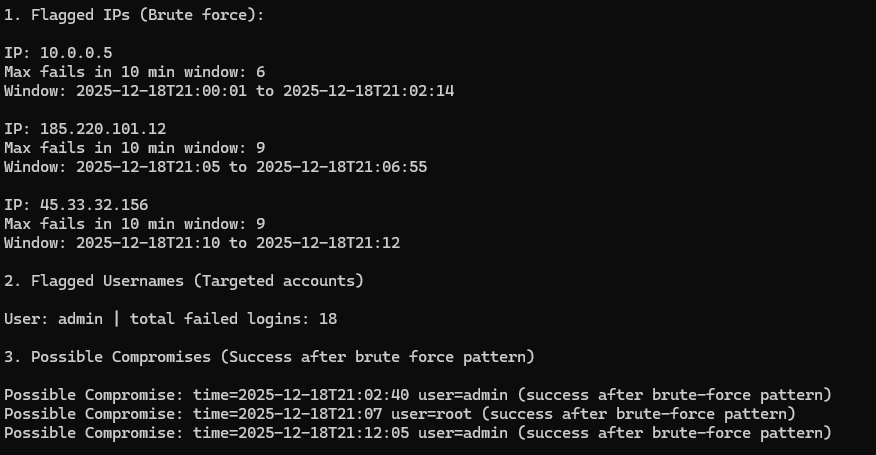

# Log-Based Intrusion Detection Tool

A Java-based security tool that analyzes authentication logs to detect brute-force attacks, targeted accounts, and potential post-compromise indicators. Generates an incident-style report summarizing all flagged activity.


## Features
- Parses authentication log files into structured events
- Detects brute-force attacks using a rolling time-window algorithm
- Identifies targeted user accounts based on repeated failed logins
- Flags successful logins following brute-force behavior as possible compromises
- Generates an incident-style security report with attack timelines and statistics

## How It Works

The tool reads a log file line by line and applies three detection rules:

**Rule 1 — Brute Force by IP:** Tracks failed logins per IP using a rolling time window. If an IP hits 5 or more failures within 10 minutes it gets flagged. Old timestamps are pruned as new events arrive so only the active window is counted.

**Rule 2 — Targeted Account:** Tracks total failed logins per username across the entire log. If a single account accumulates 8 or more failures it is flagged as a targeted account.

**Rule 3 — Possible Compromise:** If a previously flagged IP then has a successful login, it is flagged as a possible compromise — indicating the brute force may have succeeded.

## Sample Log Format
```
2025-12-18 21:00:01 FAILED_LOGIN user=admin ip=10.0.0.5
2025-12-18 21:02:40 SUCCESS_LOGIN user=admin ip=10.0.0.5
```

## Sample Report Output
```
========================================
Summary
========================================
Total failed logins:     28
Total successful logins: 5
Flagged IPs:             3
Flagged users:           1
Possible compromises:    3
========================================

1. Flagged IPs (Brute force):

IP: 10.0.0.5
Max fails in 10 min window: 6
Window: 2025-12-18T21:00:01 to 2025-12-18T21:02:14

IP: 185.220.101.12
Max fails in 10 min window: 9
Window: 2025-12-18T21:05:00 to 2025-12-18T21:06:55

IP: 45.33.32.156
Max fails in 10 min window: 9
Window: 2025-12-18T21:10:00 to 2025-12-18T21:12:00

2. Flagged Usernames (Targeted accounts)

User: admin | total failed logins: 18

3. Possible Compromises (Success after brute force pattern)

Possible Compromise: time=2025-12-18T21:02:40 user=admin (success after brute-force pattern)
Possible Compromise: time=2025-12-18T21:07:00 user=root (success after brute-force pattern)
Possible Compromise: time=2025-12-18T21:12:05 user=admin (success after brute-force pattern)
```
## Installation & Usage

**Requirements:** Java 17+

**Compile:**
```bash
javac -d bin src/LogDetector.java
```

**Run:**
```bash
java -cp bin LogDetector lib/auth.log bin/report.txt
```

- First argument: path to input log file (default: `lib/auth.log`)
- Second argument: path to output report (default: `bin/report.txt`)

## Demo



## Tech Stack
- Java 17
- Java Collections Framework (HashMap, HashSet, ArrayList)
- Java Time API (LocalDateTime, Duration)

## Detection Thresholds

| Rule | Condition |
|------|-----------|
| Brute Force | 5+ failed logins from one IP within 10 minutes |
| Targeted Account | 8+ total failed logins for one username |
| Possible Compromise | Successful login from a previously flagged IP |

